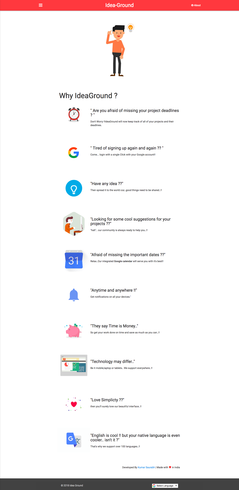
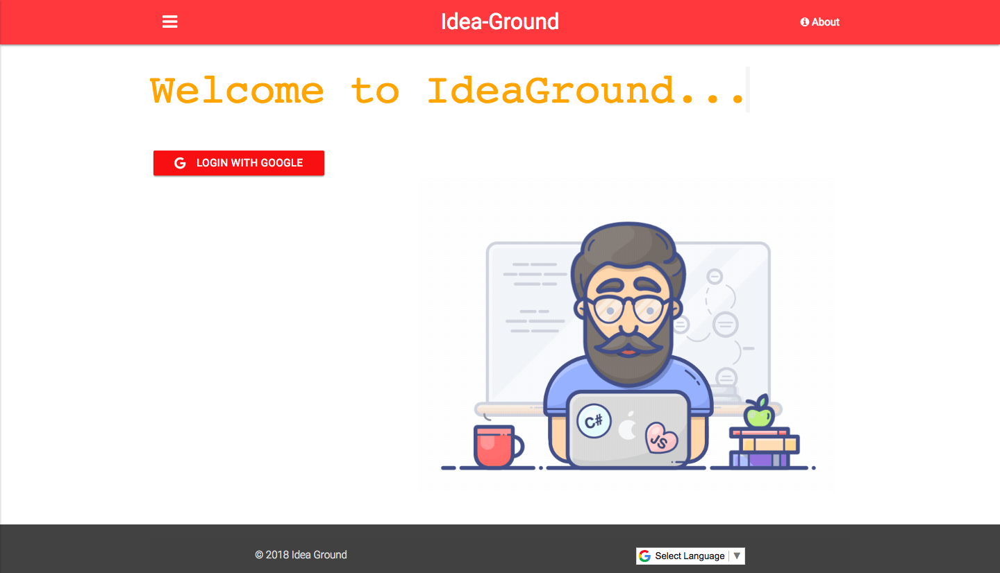
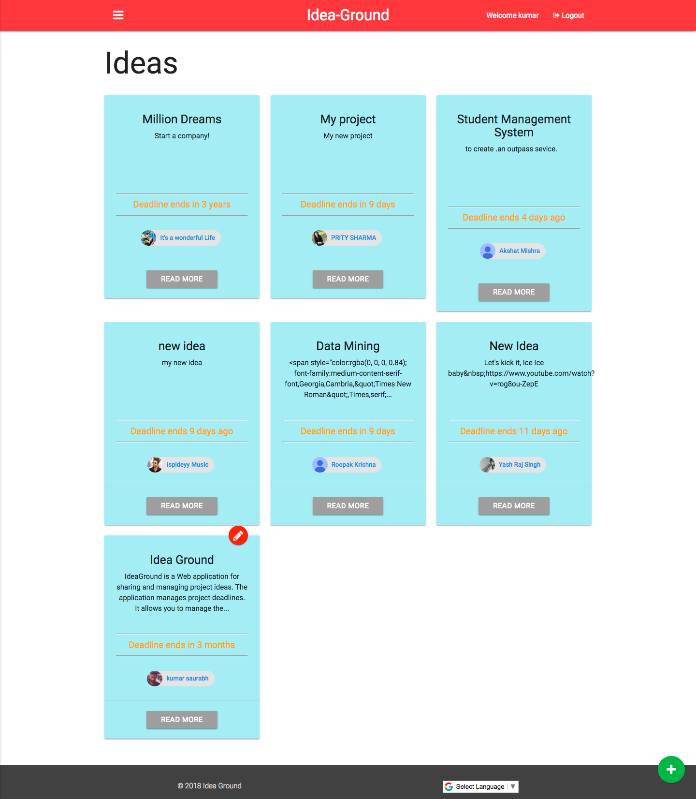
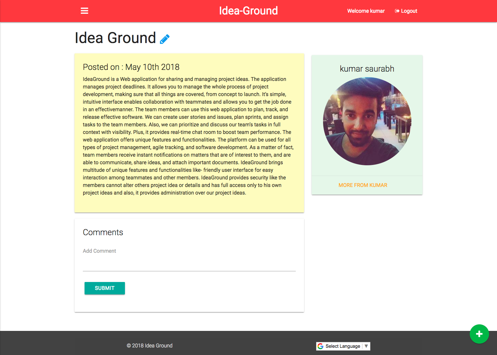

# IdeaGround
A Web application for sharing and managing projects and their deadlines. This application is an easy way of organizing various projects, and the snappiest way to equalize your work. Users can utilize the app in Mobile, Tablet, Laptop, Desktop and they will be greeted with a nice responsive Material design.

<Strong> Available Online : http://ideaground.herokuapp.com/ <Strong>

Tech Stack: 
<Strong>Node.js, Express, MongoDB, HTML5, CSS3,Javascript, Handlebars,Bootstrap,Moment.js, Material Design </strong>

* Google login using O'Auth 2.0
* Google Calendar integration
* Integrated Website Translator with 100+ language support.
* Push notifications on all your Google calendar supported devices

  

# Help & Support
<ul>
  <li><a href="https://in.linkedin.com/in/itsksaurabh">Author</a></li>
</ul>
